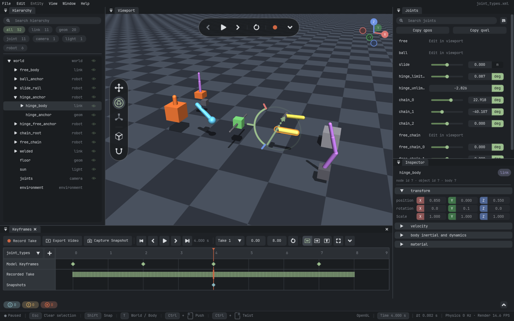
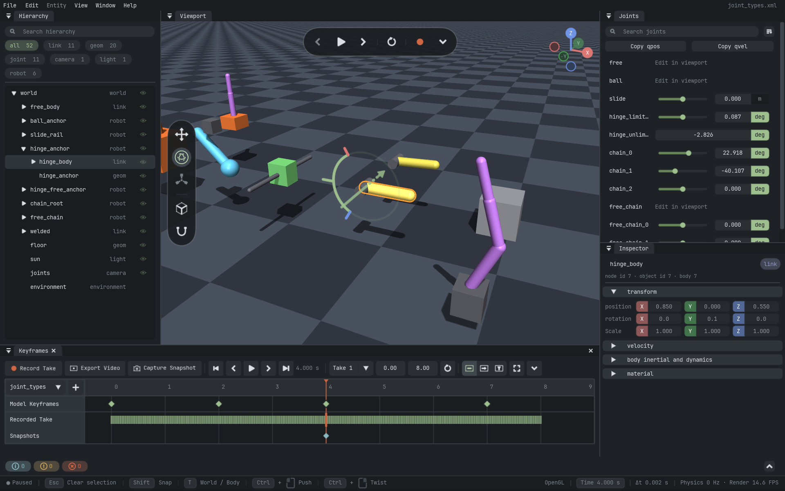
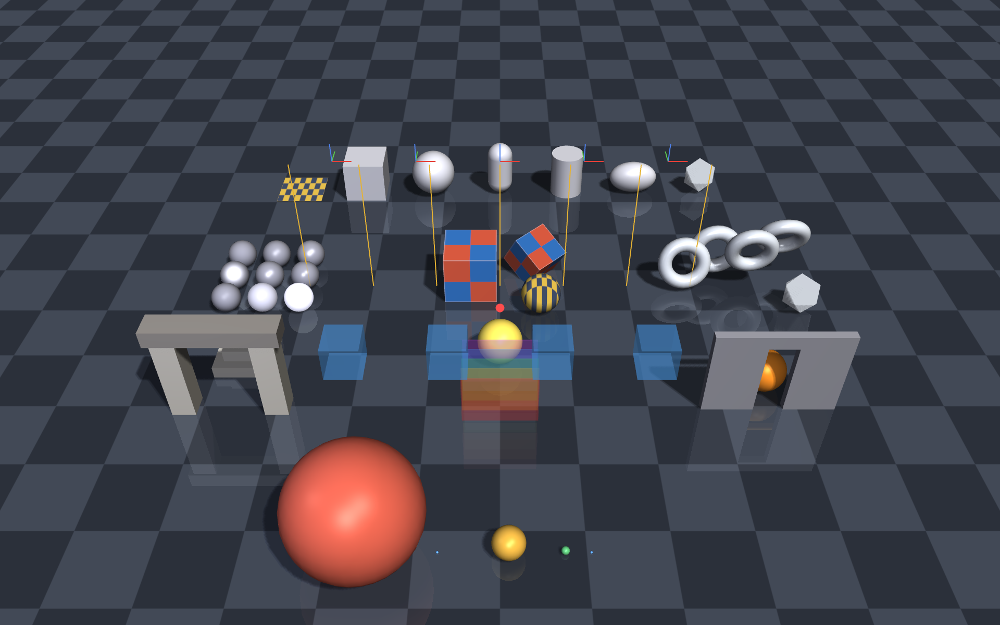

# Mojive



<p align="center">
  <strong>3D viewer, editor, and renderer for robotics and simulation.</strong>
</p>

<p align="center">
  <a href="#quick-start">Quick start</a> ·
  <a href="docs/getting-started.md">User guide</a> ·
  <a href="docs/api/index.md">API reference</a> ·
  <a href="examples/README.md">Examples</a>
</p>

Mojive stands for **Mo**del/**J**oint **I**nteractive **V**iewer & **E**ditor.

Mojive brings model inspection, scene editing, simulation control, and image rendering into one
application. It works with MJCF, URDF, Python scenes, remote publishers, and recorded sessions.

## What it does

- **Editor:** compose models, create geometry, edit materials, lights, cameras, and environment.
- **Interaction:** select objects, move free bodies, adjust joints, perturb simulations, and edit
  exact values.
- **Rendering:** produce RGB, metric depth, and segmentation images from Python or the CLI.
- **Simulation:** inspect joints, actuators, sensors, contacts, tendons, constraints, and keyframes.
- **Integration:** connect custom simulations through adapters or publish scenes over the network.
- **Automation:** capture images, record video, replay snapshots, and control a local viewer by RPC.

OpenGL is the default renderer. wgpu is available as an optional test backend.

## Preview

| Joint tools | Renderer |
| :---: | :---: |
|  |  |
| Focus a joint and adjust it in the viewport. | The bundled showcase rendered with OpenGL. |

All images in this README are unmodified Mojive captures.

## Quick start

Mojive requires Python 3.11 or newer. The default window uses an OpenGL 3.3 core profile.

```bash
git clone https://github.com/acrlw/mojive.git
cd mojive
uv sync --python 3.11 --extra mujoco
uv run mojive editor
```

Open a bundled scene, MJCF file, or URDF file:

```bash
uv run mojive view test_scene
uv run mojive view path/to/model.xml --paused
uv run mojive view path/to/model.urdf --paused
```

To install without `uv`:

```bash
python3.11 -m venv .venv
source .venv/bin/activate
python -m pip install -e ".[mujoco]"
mojive editor
```

For development dependencies:

```bash
make setup
```

This also builds the [bulk UI drawing bindings and slider/focus fixes](docs/how-to/ui-corners.md),
requiring CMake and a C++17 toolchain. Launch that build with `uv run --no-sync mojive editor`.

For Python offscreen rendering on a Linux server, OpenGL uses EGL and needs a working GPU
driver/EGL installation, but no desktop display. In `MOJIVE_GL=auto`, a failed EGL initialization
can fall back to a hidden GLFW window on a desktop's main thread. Set `MOJIVE_GL=egl` to require
display-free EGL, or `MOJIVE_GL=glfw` to select the desktop path explicitly. Hidden windows still
need X11/Wayland. See [context troubleshooting](docs/reference/configuration.md#render-backend-requirements).

## Render backends

OpenGL is the default and recommended backend. To test wgpu:

```bash
uv sync --extra mujoco --extra wgpu
MOJIVE_BACKEND=wgpu uv run mojive editor
```

`MOJIVE_BACKEND` selects `opengl` or `wgpu`. The CLI `--backend` option selects the scene adapter,
such as `mujoco` or `toy`.

```bash
uv run mojive backends
uv run mojive assets --quick
uv run mojive --help
```

## Editor

The editor reads and writes `.mojive.json` workspaces. A workspace can contain multiple MJCF or
URDF models, resource directories, model edits, and Mojive-authored entities.

Use **File > Save As > MuJoCo XML / MJCF** to export a standalone MuJoCo model. The
[editor guide](docs/guides/editor-and-mjcf.md) covers composition, topology editing, assets,
keyframes, resource repair, and export.

Select a camera to edit it. Enable **preview** in Inspector when a live camera preview is useful.

### Common controls

| Input | Action |
|---|---|
| `Space` | Play or pause |
| `Backspace` | Previous frame; hold to rewind |
| `G` / `R` | Position / rotation gizmo |
| Unbound by default | Primitive dimensions gizmo; assign in Settings or code |
| `T` | Switch body/world frame |
| `Shift` while dragging | Snap |
| `Ctrl` + left/right drag | Translation/rotation perturbation |
| `F` | Frame the scene |
| `F9` | Open Settings |

Input bindings can be changed in Settings. UI scale and language normally follow the desktop:

```bash
MOJIVE_UI_SCALE=1.5 uv run mojive editor
MOJIVE_LANGUAGE=zh_CN uv run mojive editor
```

See the [configuration reference](docs/reference/configuration.md) for every runtime option.

## Python rendering

`mojive.Renderer` follows the familiar `mujoco.Renderer` update-and-render loop:

```python
import mujoco

from mojive import Renderer

model = mujoco.MjModel.from_xml_path("model.xml")
data = mujoco.MjData(model)

with Renderer(model, width=640, height=480) as renderer:
    mujoco.mj_forward(model, data)
    renderer.update_scene(data, camera=-1)
    rgb = renderer.render()

    renderer.enable_depth_rendering()
    depth_m = renderer.render()

    renderer.enable_segmentation_rendering()
    object_id_and_type = renderer.render()
```

The API accepts free, fixed, named, and `MjvCamera` cameras. It also accepts `MjvOption`, reusable
output arrays, and multiple renderer instances.

Start with the [rendering tutorial](docs/tutorials/mujoco-rendering.md), then use the
[rendering API reference](docs/api/rendering.md) for details.

## Python scenes and custom simulations

Create geometry, cameras, lights, and materials directly in Python:

```python
from mojive import Light, Scene, build_scene

scene = Scene()
ball = scene.sphere(name="ball", position=(0.0, 0.0, 0.5))
key = scene.add_light("key", Light())
viewer = build_scene(scene)

for frame in range(300):
    ball.set_pose((frame * 0.01, 0.0, 0.5))
    viewer.sync()

key.remove()
viewer.release()
```

A custom simulation implements `SceneAdapterBase`:

- `scene_source()` supplies stable meshes, materials, and object identities.
- `frame()` supplies poses and other changing data.
- `AdapterCaps` declares the commands and data the adapter provides.

See the [custom adapter guide](docs/how-to/custom-adapter.md) and the runnable
[examples](examples/README.md).

## Remote viewing, replay, and automation

Run simulation in one process and view it from another:

```bash
uv run mojive serve deformables --host 127.0.0.1 --port 47650
uv run mojive attach --host 127.0.0.1 --port 47650
```

Record and replay a published session:

```bash
uv run mojive serve deformables --record-snapshot output/session.fvs
uv run mojive replay output/session.fvs --loop
uv run mojive attach
```

Start a local control service and query it from another process:

```bash
uv run mojive rpc-serve test_scene --socket output/mojive.sock
uv run mojive control get_state --socket output/mojive.sock --json
```

See the [remote viewing tutorial](docs/tutorials/remote-viewing.md) and
[local RPC guide](docs/how-to/rpc-control.md).

## Development

Mojive remains a Python package: its public API lives in `python/src/mojive`, and selected native
implementation work lives in `cpp`. Upstream sources are managed under `3rdparty`. See the
[Python/C++ development guide](docs/guides/development.md) for Qt-style C++ naming, dependency
setup and the boundary between Python application logic and native infrastructure.
The optional native preview now launches the existing Viewer with `make native-viewer`;
see the [native Viewer guide](docs/how-to/native-viewer.zh.md) for setup and current limitations.

For custom widgets, icons, or diagnostics, start with [Extend UI drawing](docs/how-to/ui-drawing.md)
for module ownership, API examples, coordinate units, caching, and focused verification.

Use focused targets while working, then run the repository checks:

```bash
make check
make gpu                 # rendering changes
make docs-check          # documentation changes
```

Useful targets:

```bash
make renderer-api
make renderer-benchmark
make mujoco-audit
make adapter-conformance ADAPTER=mujoco CONFORMANCE_ASSET=deformables
make gizmo-gallery
make showcase
make help
```

Generated captures, recordings, reports, and the documentation site go to `output/`.
`make readme-media` captures with OpenGL and copies the selected images unchanged into the README.

## Architecture

```text
MJCF / URDF / Scene / remote stream
                 │
              adapter
                 │ SceneSource + SceneFrame
                 ▼
              Session
                 │
        OpenGL or wgpu renderer
                 │
          viewport or image
```

- Adapters translate models, simulations, and network data.
- `Session` owns selection, history, overrides, simulation control, and command routing.
- Renderers own GPU resources and output images.
- The UI reads session state and submits typed commands.

See [Architecture](docs/concepts/architecture.md) and [Renderer design](docs/RENDERER.md).

## Documentation

- [Getting started](docs/getting-started.md)
- [Editor and MJCF](docs/guides/editor-and-mjcf.md)
- [CLI](docs/reference/cli.md) and [configuration](docs/reference/configuration.md)
- [API map](docs/api/index.md)
- [Testing](docs/guides/testing.md)

## License

[MIT](LICENSE)
