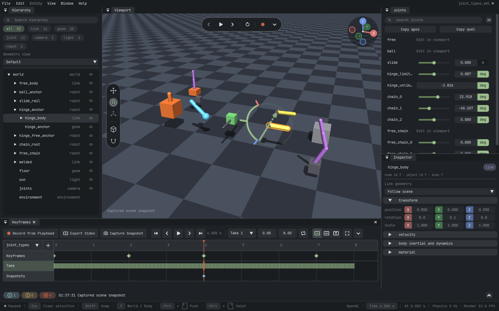

# Mojive

Mojive stands for **Mo**del/**J**oint **I**nteractive **V**iewer & **E**ditor.

Mojive is a backend-neutral 3D viewer, editor, and renderer for robotics, simulation, and tooling.
The OpenGL and wgpu renderers consume stable scene structure and dynamic frame data from MuJoCo,
programmatic scenes, custom physics engines, remote publishers, and snapshot recordings.

The project provides three primary workflows:

- An interactive editor for model composition, entity authoring, inspection, and simulation.
- A MuJoCo-compatible `Renderer` API for RGB, depth, and segmentation output.
- A scene adapter protocol for custom physics engines, remote viewing, and replay.